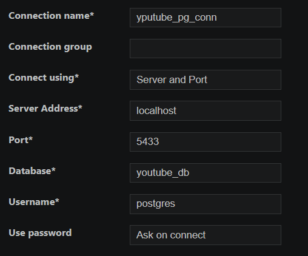

# SQL_Certification_Chai_aur_code

To create a postgres container:(NOTE: docker engine must be running).
docker run -d --name youtube_pg -e POSTGRES_PASSWORD=postgres -p 5433:5432 postgres:18

** NOTE: this youtube_pg is database server and not database itself.
FOllowing this, we would create a database inside this database server. This would store our table and records.
For this run following commands in the terminals:
1. open postgres command line editor: docker exec -it youtube_pq psql -U postgres.
--> to quit type: \q
2. CREATE DATABASE youtube_db;
3. Extensions==> cylinder icon in sidbar===>Known as Sql tools===> click on postgres.
4. Configure the following as:

** Note: Username was not assigned at the time of docker intialization, but password was given as: postgres. so, let use same string as both username and password.

5. Scroll down and click "SAVE CONNECTION" and then click "CONNECT NOW".

